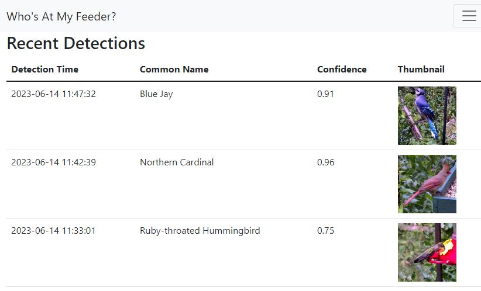

# Check out: [k1n6b0b/feederwatch-ai](https://github.com/k1n6b0b/feederwatch-ai)

> **This fork has been superseded.** Active development has moved to [k1n6b0b/feederwatch-ai](https://github.com/k1n6b0b/feederwatch-ai) — a ground-up rewrite as a native Home Assistant integration. If you're setting up bird detection for the first time, start there. You can even import your Who's At My Feeder database to the new platform :)


---
# Who's At My Feeder?


> **Fork notice:** This is a personal fork of [mmcc-xx/WhosAtMyFeeder](https://github.com/mmcc-xx/WhosAtMyFeeder). All original work and credit belongs to the original author. This fork adds deployment improvements and cherry-picked community contributions while the upstream project is inactive and contains no license. Due to this I *will likely not* be maintaing the code base.

Who's At My Feeder? is a sidecar app for [Frigate NVR](https://frigate.video/) that automatically identifies bird species from Frigate detections. It uses a [Google AIY bird classifier model](https://tfhub.dev/google/lite-model/aiy/vision/classifier/birds_V1/3) to classify snapshots and stores the best-scoring identification per Frigate event.



## Features

- Identifies bird species from Frigate snapshots using a TensorFlow Lite model
- Stores one detection per Frigate event (best score wins)
- Populates Frigate sub-labels with the identified species (first 20 characters)
- Web UI showing recent detections, daily summaries, per-hour breakdowns, and video clips
- Deletes detections via the UI or API

### This fork adds

- **MQTT TLS support** — encrypted broker connections with optional certificate verification (cherry-picked from upstream [PR #30](https://github.com/mmcc-xx/WhosAtMyFeeder/pull/30) by [@Adminiuga](https://github.com/Adminiuga))
- **MQTT detection publish** — publishes identified species to `whosatmyfeeder/detections` on each detection (cherry-picked from upstream [PR #46](https://github.com/mmcc-xx/WhosAtMyFeeder/pull/46) by [@rw377](https://github.com/rw377))
- **MQTT new species alert** — publishes to a `whosatmyfeeder/new_species/*` topic hierarchy the first time a species is ever detected; ideal for Home Assistant automations. Topics: `common_name`, `scientific_name`, `score`, `camera`, `frigate_event` (all retained by broker)
- **Frigate sub-label fallback** — when WAMF's classifier scores below threshold, falls back to Frigate's built-in bird classification (`sub_label`) so low-confidence sightings are still recorded; handles Frigate's 20-character truncation via prefix matching
- Python 3.11 base image (upstream uses 3.8, which is EOL)
- Image published to GitHub Container Registry (ghcr.io) with SHA-pinned deploys and automatic rollback support
- CI pipeline with secret scanning (gitleaks), vulnerability scanning (Trivy), and automated tests

## Prerequisites

1. A working Frigate installation with at least one camera configured
2. An MQTT broker that Frigate is connected to
3. Frigate configured to detect and snapshot the `bird` object

### Frigate configuration

Frigate must be set up to detect the [`bird` object](https://docs.frigate.video/configuration/objects) and send [snapshots](https://docs.frigate.video/configuration/snapshots). See the full [Frigate configuration reference](https://docs.frigate.video/configuration/).

> **HAOS note:** If you run Frigate as a Home Assistant add-on and WhosAtMyFeeder on a separate machine, you need to explicitly expose port 5000 in the Frigate add-on network settings — it is only exposed internally by default.

Example Frigate config (reference only — tune for your hardware):

```yaml
mqtt:
  host: <your-mqtt-host>
  port: 1883
  topic_prefix: frigate
  user: mqtt_username_here
  password: mqtt_password_here
  stats_interval: 60
detectors:
  coral:
    type: edgetpu
    device: usb
ffmpeg:
  global_args: -hide_banner -loglevel warning
  hwaccel_args: preset-vaapi
  input_args: preset-rtsp-generic
  output_args:
    detect: -threads 2 -f rawvideo -pix_fmt yuv420p
    record: preset-record-generic
detect:
  width: 1920
  height: 1080
objects:
  track:
    - bird
snapshots:
  enabled: true
cameras:
  birdcam:
    record:
      enabled: true
      events:
        pre_capture: 5
        post_capture: 5
        objects:
          - bird
    ffmpeg:
      hwaccel_args: preset-vaapi
      inputs:
        - path: rtsp://<your-camera-ip>:8554/cam
          roles:
            - detect
            - record
    mqtt:
      enabled: true
      bounding_box: false
      timestamp: false
      quality: 95
```

## Setup

### 1. Directory structure

Create a directory on your host and set it up as follows:

```
/whosatmyfeeder/
├── docker-compose.yml
├── config/
│   └── config.yml
└── data/
```

### 2. Configuration

Copy `config/config.yml.example` to `config/config.yml` and edit it for your environment:

```yaml
frigate:
  frigate_url: http://<your-frigate-ip>:5000
  mqtt_server: <your-mqtt-host>
  mqtt_auth: false
  # mqtt_username: your-username
  # mqtt_password: your-password
  mqtt_port: 1883           # Optional, default: 1883
  mqtt_use_tls: false       # Optional: enable TLS for broker connection
  mqtt_tls_insecure: false  # Optional: skip broker certificate verification
  # mqtt_tls_ca_certs: /path/to/ca.crt
  main_topic: frigate
  camera:
    - your-camera-name
  object: bird
classification:
  model: model.tflite
  threshold: 0.7            # Confidence threshold (0–1). Lower = more detections, less accurate.
webui:
  port: 7766
  host: 0.0.0.0
```

### 3. docker-compose.yml

```yaml
version: "3.6"
services:
  whosatmyfeeder:
    container_name: whosatmyfeeder
    restart: unless-stopped
    image: ghcr.io/k1n6b0b/whosatmyfeeder:latest
    volumes:
      - ./config:/config
      - ./data:/data
    ports:
      - 7766:7766
    environment:
      - TZ=America/New_York
```

### 4. Run

```bash
docker compose up -d
```

The web UI is available at `http://<your-server>:7766`.

## Docker image

This fork's image is built automatically on every push to `main` and published to the GitHub Container Registry:

```
ghcr.io/k1n6b0b/whosatmyfeeder:latest
```

> **Note:** The original upstream image is on Docker Hub: `mmcc73/whosatmyfeeder`

## Development

```bash
# Install test dependencies
python3 -m venv .venv
.venv/bin/pip install -r requirements-test.txt

# Run tests
.venv/bin/pytest tests/ -v
```

Tests cover all query functions and Flask routes. They use temporary SQLite databases and do not require a running Frigate instance or real config file.
